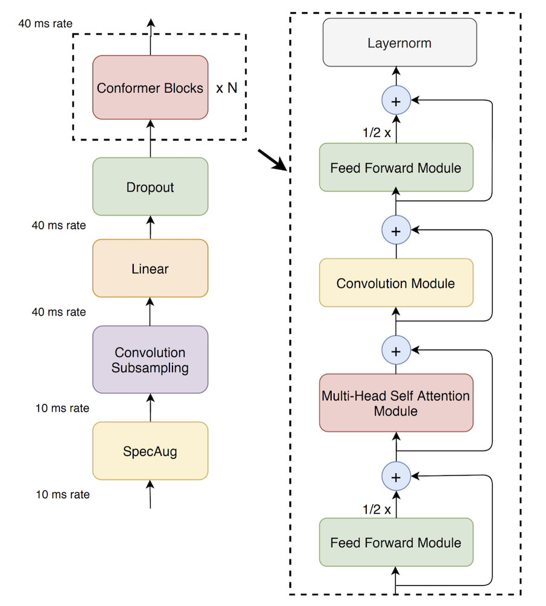
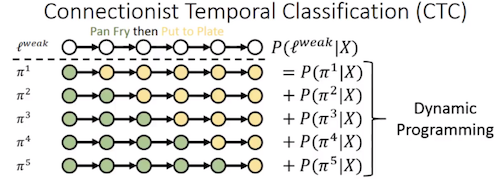
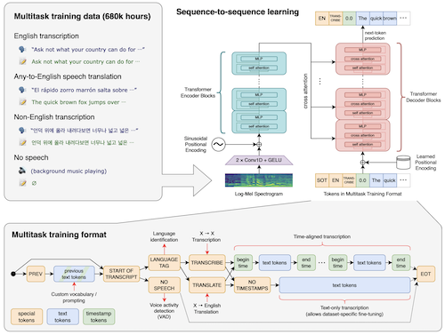

# 결선 수상 방법론
```
대회의 전반적인 내용은 '개요'폴더에 작성
```

# 1. Deep Learning From Scratch Only Using Contest Dataset
## 1.1 Main Architecture : Conformer


```
Number of Encoder Layer : 8
Feed forward expansion factor : 2
Feature dim : 512

예선을 통해서 Encoder Layer가 8개 정도면 준수한 성능을 갖음을 확인 하였음.
최근 Tranformer계열 모델들은 Expansion Factor를 4로 사용하나,
시간과 자원이 한정된 대회에서 에자일 하게 움직이기 위해 2를 선택함.

ref. https://arxiv.org/abs/2005.08100
```

## 1.2 Loss Function : CTCLoss

```
인풋과 아웃풋의 사이즈 길이가 다를 경우, NLLoss, CrossEntropy등을 활용할 수 있으나,
음성인식, OCR, Image2Str 등에서 CTCLoss를 사용하여, 본 팀에서도 CTCLoss를 사용함.
```



## 1.3 Optimizer : RMSprop
```
대회 초기에 Optimizer로 RAdam, Adam을 사용하였으나, 비수렴하여
논문들과 각종 레퍼런스를 참고하여 RMSprop + Learing Rate Scheduler 전략을 사용했을 경우 초기 수렴에 강점을 갖음을 발견

ref http://www.tbluche.com/ctc_and_blank.html
```
## 1.4 Output dim
```
음성인식에서 최종 예측을 모음, 음소, 음절, BPE, 단어 단위로 예측을 진행하나
본 대회에서 음절 단위로 예측을 진행하였고, 2000개의 음절을 예측하는 것으로 진행하였다.

```

## 1.5 훈련 전략
### First : 첫번째 훈련 과정 (WarmUp)
```
앞에서 언급 하였듯 초기 수렴 이슈가 있었음.
1. No Agumentation : 모델이 초기에 옳바른 방향으로 학습이 되게 하고자, Data Feeding에 있어서, 
Agumentation및 Noise등을 추가하지 않고 최대한 깔끔한 음질의 데이터를 주입하려고 노력하였음.

2. Not Necessary Padding : Batch Size의 최대 길이 값으로 패딩을 할 경우, 
짧은 길이의 데이터 에게는 패딩이라는 쓸모 없는 데이터들이 주입이 됨.
이를 해결하고자, 데이터를 길이 순으로 소팅하고 Batch Size로 나누어 모델에 주입함

3. 모델에서 DropOut Ratio들을 모두 0으로 선정
```

### Second : 두번째 훈련 과정 (Main Training)
```
1. Data Agumentation : 생활소음, 가우시안 노이즈 등... 을 적용
2. Random Batch Padding : Padding이라는 쓸모 없는 데이터를 추가하여, 현실과 훈련 상황을 동일하게 맞춰줌
3. 모델의 Attention Dropout, FFD Dropout : 0.1로 선언하여 훈련에 어려움을 추가함.
```

### Thrid : LM Decoder (Post-Process)
```
1. N-gram : 5-gram 확률 기반 언어모델 개발
(대회의 특성상 1시간 내로 Inference를 마무리 해야 하여, NN기반 언어모델을 만들기에 무리가 있었음.)

ref. https://kheafield.com/papers/avenue/kenlm.pdf

2. Greedy : ouput결과에서 매시점 2000개의 음절 중 가장 높은 확률값으로 예측
```

---
---

# 2. Using Pretrained Model
## 2.1 Main Architecture : Whisper


```
- General-purpose speech recognition model로서, ASR뿐만 아니라 Multi-Languate Translation도 가능한 모델
- 해당 모델은 Attention Is All You Need 논문과 비슷하게 Encoder Decoder 구조를 갖고 있으며
BPE를 적용하여 따로 Decoding에 특별한 언어 모델이 없어도 준수한 성능을 갖고 있음.
- 대회 제약 조건으로 2시간 혹은 1시간 내로 추론을 끝내야 하기 때문에 whisper/tiny를 선택하였음.
```

