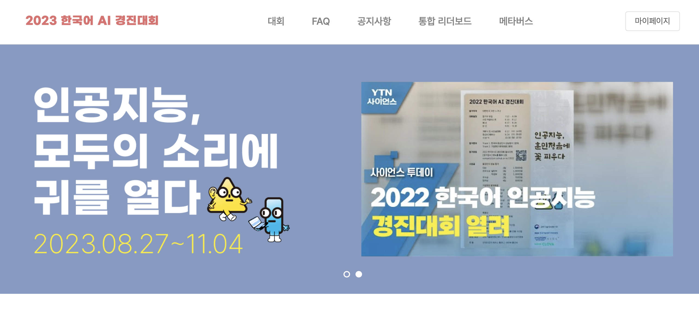
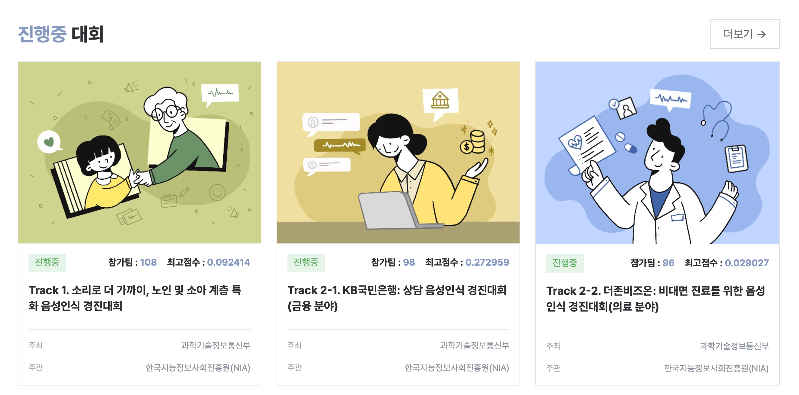

# 2023_Korean_AutoSpeechRecognition_Contest

# 0. 결과
- 예선 : 100팀중 상위 25개팀에 선정.
- 본선 : 25개 팀중 7등으로 본선 진출.
- 결선 : 10개 팀중 장려상 수상.





# 1. 개요
## 트랙 2 - KB국민은행: 상담 음성인식 경진대회(금융 분야)
### 1.1) 2023 한국어 AI 경진대회 Track 2-1. KB국민은행: 상담 음성인식 경진대회(금융 분야)
```
2023 한국어 AI 경진대회는 AI Hub 개방 한국어 음성 데이터를 사용하여 한국어 음성인식 인공지능 모델을 개발하는 대회입니다.
한국어 음성 데이터를 이용하여 한국어 음성인식 인공지능 모델을 만들어보세요!
```

### 1.2) 챌린지 내용
- 금융분야 상담 음성 데이터를 활용한 음성인식 모델 개발
- 참고 데이터 : 상담 음성 데이터 - https://www.aihub.or.kr/aihubdata/data/view.do?dataSetSn=100

### 1.3) 일정
- 예선 : 2023년 9월 24일(일) ~ 2023년 9월 27일(수)
- 본선 : 2023년 10월 10일(화) ~ 2023년 10월 23일(월)
- 결선 : 2023년 10월 30일(월) ~ 2023년 11월 4일(토)

### 1.4) 참가대상
- 대한민국 국민 누구나